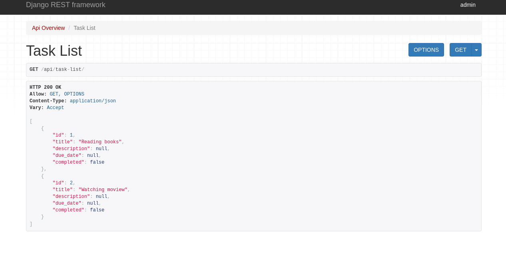

# Regarding backend Api

### TaskList

```
http://127.0.0.1:8000/api/task-list/
```



### TaskDetails
You need to type http://127.0.0.1:8000/api/task-detail/id where id is id of the task
```
http://127.0.0.1:8000/api/task-detail/4
```


